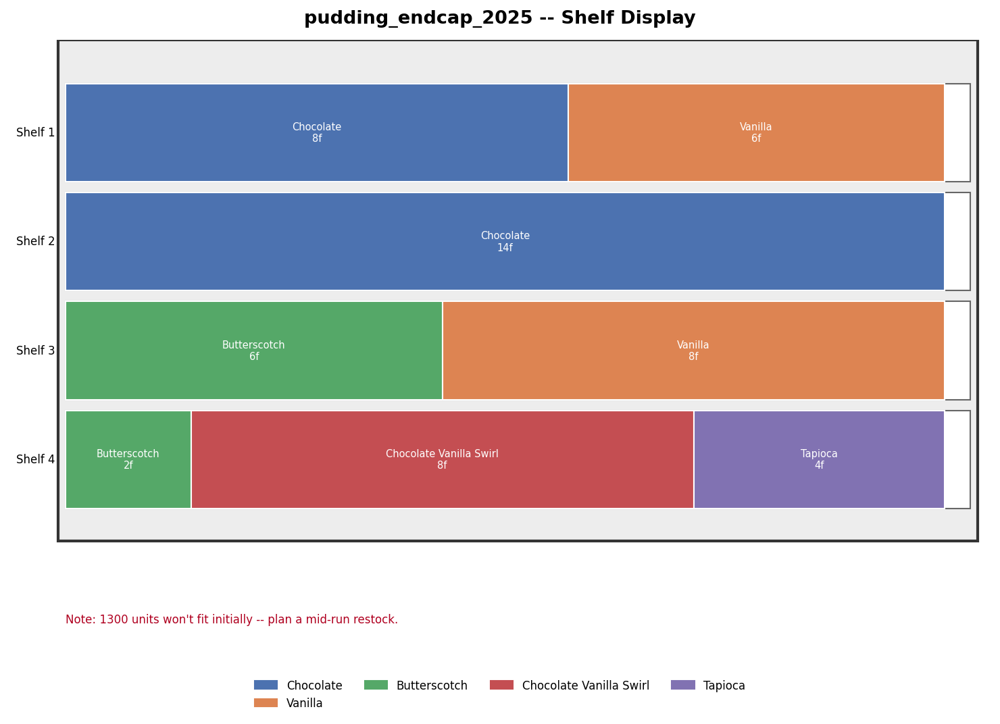
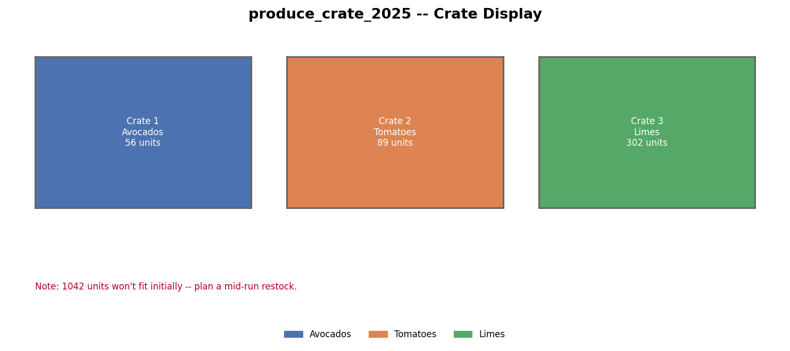
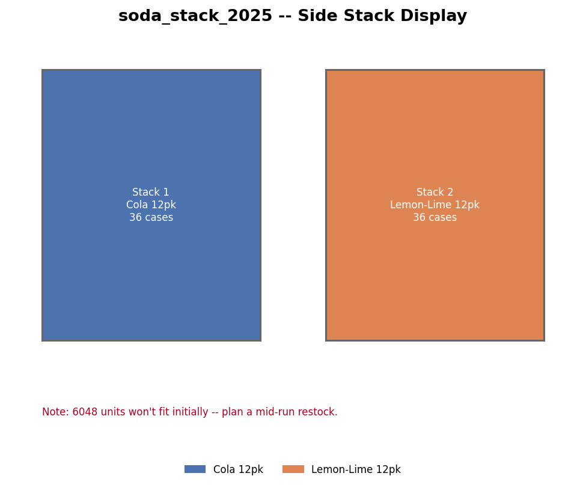

# Retail Display Planner

Forecasts how much product to order for a retail display, splits the order
across varieties based on sales history, and generates a mockup of the
display so you can look at it before actually ordering anything.



Started this as a way to actually use what I was learning in Python for
something at work instead of just doing tutorial exercises. It began as a
plain forecasting script and slowly turned into this — SQLite storage, an
LP optimizer for shelf layout, a feedback loop that corrects future
forecasts based on how past ones actually did.

## What's in it

Forecasting takes last year's sales for a variety and projects this year's
number, adjusted for how long the display's up, a growth target, whether
it's tied to a promo, and any planned discount (using a price elasticity
multiplier). If a variety sold out last year the forecast bumps up a bit
to account for demand you didn't actually capture.

Once you've got a forecast, allocation rounds it up to whole cases and
makes sure even slow-moving varieties get a minimum amount instead of
getting rounded down to nothing.

Then it has to figure out how the order actually fits on the display,
which depends a lot on what kind of fixture it is. Shelf displays go
through an LP optimizer (`src/optimizer.py`) that decides how many facings
each variety should get based on a diminishing-returns curve, and then
places them with eye-level shelves prioritized for your best sellers.
Crates and side-stacks don't really benefit from that kind of optimization
since you're usually only dealing with a handful of fixtures, so those use
a simpler greedy approach instead — biggest orders get first pick, floor
guarantees where possible.

After the layout's figured out, `mockup.py` draws the whole thing as a PNG.

The last piece is a feedback loop — once a display actually runs, you log
what really happened, and the next forecast for that variety gets
corrected based on the gap between what was predicted and what actually
sold. Same idea for discount elasticity, if you've logged a variety at a
few different discount depths it'll fit a real coefficient instead of
using the -1.5 default guess.

Everything's backed by SQLite now (`data/planner.db`) — the CSVs are still
how you actually edit input data, they just get synced into the database
on every run. And there's a validation pass before any of the math
happens, since something like typing a discount as `20` instead of `0.20`
won't crash anything, it'll just quietly produce a wrong order.

## a few different fixture types




crate displays (bulk bins, produce, that kind of thing) and side-stacks
(whole cases stacked up, pallet-style) work totally differently from
shelves under the hood - no facings, no eye-level math, just volume and
case-footprint calculations. same forecasting/allocation pipeline feeds
into all three though.

## Running it

```
pip install matplotlib pulp pytest --break-system-packages
```

```
python -m src.main
python -m src.main --display-id produce_crate_2025
python -m src.main --list
```

There's a sample display for each fixture type already in the data folder
- pudding_endcap_2025 (shelf), produce_crate_2025 (crate), soda_stack_2025
(side stack) - so you can just run those and see what comes out without
setting anything up yourself.

`pytest -v` runs the test suite (167 tests as of writing this).

## Using your own data

Two CSVs, both keyed by display_id.

`data/sales_history.csv` has one row per variety - name, prior year units,
case pack, dimensions, discount info, that sort of thing. Most columns are
optional and default to something reasonable if you leave them blank.

`data/displays.csv` has one row per display - how long it's up (this is
the only field that's actually required), growth target, whether it's
tied to a promo, and which fixture type it is.

Fixture dimensions themselves (how many shelves you've got, how big the
crates are) are still just hardcoded in `_setup_fixtures()` in main.py.
Could move that to a CSV too at some point, just hasn't been worth doing
yet.

## Layout

```
src/
  models.py          - Variety, Shelf, Crate, SideStack, DisplayConfig, VarietyOrder, ResultRecord
  forecasting.py      - prior year sales -> this year's forecast
  allocation.py         - forecast -> case-rounded order
  layout.py               - shelf facing placement
  crate_layout.py           - bulk bin allocation
  stack_layout.py             - case stack allocation
  optimizer.py                  - LP facing optimizer (shelf only)
  mockup.py                       - draws the layout
  db.py                             - SQLite storage
  learning.py                        - bias correction + elasticity fitting
  validation.py                       - input checks
  io_utils.py                          - CSV loading
  main.py                                - CLI
tests/     one file per module above
data/       sample CSVs, generated db and mockup images
```

## stuff that's not done / would want to fix

- no shopping list export - just a plain csv of variety + cases to order
  would be genuinely useful and I haven't gotten around to it
- the eye-level shelf weighting is just a merchandising rule of thumb I
  found, not real data. same with the curve shape the LP optimizer uses
  for diminishing returns on extra facings - both are guesses that would
  be worth replacing once there's enough logged history to fit something
  real
- forecasting only looks at one prior year, blending a couple years with
  more weight on the recent one would probably be more stable
- no uncertainty range on the forecast, it's a single number even though
  there's a handful of stacked guesses behind it (growth target x
  elasticity x bias correction). a conservative/expected/aggressive range
  would be a more honest way to present it
- thought about real ML forecasting but there's nowhere near enough
  logged displays to train anything on right now, so it's not worth the
  complexity yet
